# Kız Başına - Patika dev Bootcamp Projesi

İmregül Kurt

# Airline Passenger Satisfaction Veri Analizi

Bu projede "Airline Passenger Satisfaction" veri seti üzerinden veri analizi uygulamaları yaptım. Bu projedeki amacım veri setindeki sayısal ve kategorik değişkenleri incelemek, eksik ve aykırı değerleri tespit etmek ve temel görselleştirmelerle veri setine dair genel bir bakış elde etmektir.

## 1. Gerekli Kütüphanelerin Yüklenmesi

Analiz boyunca pandas, matplotlib ve seaborn kütüphanelerini kullanacağım.

## 2. Veri Setinin Yüklenmesi

Analizde kullanacağımız veri seti train.csv adlı dosyada yer almakta. İlk adım olarak bu dosyayı pandas ile yüklüyoruz ve ilk birkaç satırına göz atıyoruz.

Not: test.csv dosyasını kullanmama sebebim train.csv dosyasının daha büyük bir dataset içermesi ve yeterli olması.

## 3. Veri Setine Genel Bakış

Veri setinde kaç gözlem ve özellik bulunduğuna, sütun türlerine ve eksik değer olup olmadığına dair ilk incelemeyi yapıyoruz.

## 4. Sayısal ve Kategorik Değişkenlerin Ayrılması

Sayısal ve kategorik sütunları ayırarak analiz sürecini daha verimli bir hale getireceğiz.

## 5. İstatistiksel Özet

Sayısal değişkenler için temel istatistikleri (`mean`, `median`, `min`, `max`, `std`) inceliyoruz. Kategorik değişkenlerin ise sınıf dağılımına bakıyoruz.

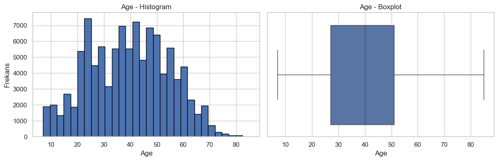
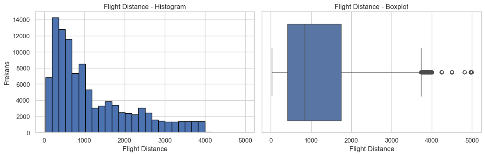

### İstatistiksel Özet - Bazı Görselleştirmeler

Bazı değişkenlerin dağılımını ve merkezi eğilimlerini görselleştirerek daha iyi bir fikir edinmeye çalışıyoruz.

## 6. Temel Yorumlar

Bazı sütunlar hakkında temel gözlemler yapıyoruz. Örneğin yaş dağılımı, uçuş mesafeleri ve gecikme süreleri gibi.

### Temel Yorumlar - Ek

Hizmet olarak birçok kategori olduğu için onları bir arada ele alarak bir inceleme yapıyoruz.

## 7. Eksik Değer Analizi

Veri setinde eksik değer bulunan sütunları belirliyor ve eksik veri oranlarını inceliyoruz.

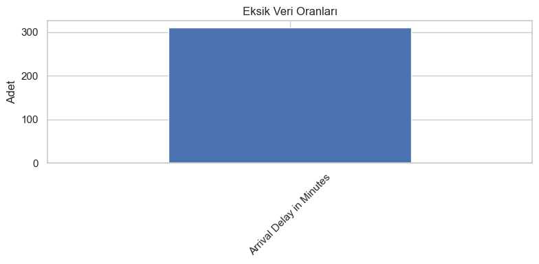

### Eksik Değerlerle Baş Etme Yöntemleri

Veri setindeki eksik değerler analiz ve modelleme süreçlerinde sorun yaratabilir. Bu nedenle eksik değerlerle başa çıkmak önemlidir. Kullanılabilecek bazı yöntemler:

- **Ortalama ile doldurma (mean)**: Sayısal verilerde yaygın olarak tercih edilir. Aykırı değer çoksa medyan daha güvenlidir.
- **Medyan ile doldurma**: Ortalama yerine daha dayanıklı bir alternatiftir.
- **En sık gözlenen değer ile doldurma (mode)**: Kategorik veriler için tercih edilir.
- **Satırları silme**: Eksik değer oranı çok düşükse kullanılabilir.
- **İleri düzey yöntemler**: Tahmine dayalı doldurma, regresyon, KNN imputation gibi yöntemler de vardır ama bu projede basit yöntemler tercih edilmiştir.

Aşağıdaki örnekte "Arrival Delay in Minutes" sütunundaki eksik değerleri ortalama ile dolduruyoruz ve değişimin histogram üzerindeki etkisini gözlemliyoruz.

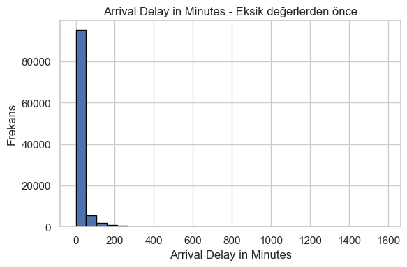
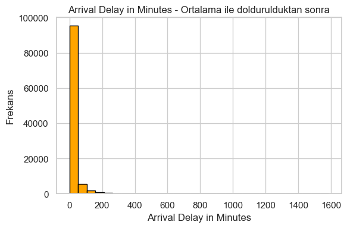

## 8. Aykırı Değer Analizi ve Görselleştirilmesi

Sayısal sütunlarda aykırı değerleri belirlemek için IQR (Interquartile Range) yöntemi kullanıyoruz. Aşağıdaki grafiklere baktığımızda özellikle gecikme süresi (Arrival Delay in Minutes) değerinde aykırı değerlerin yoğun olduğunu görüyoruz.

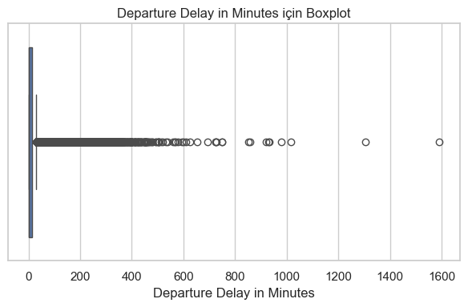
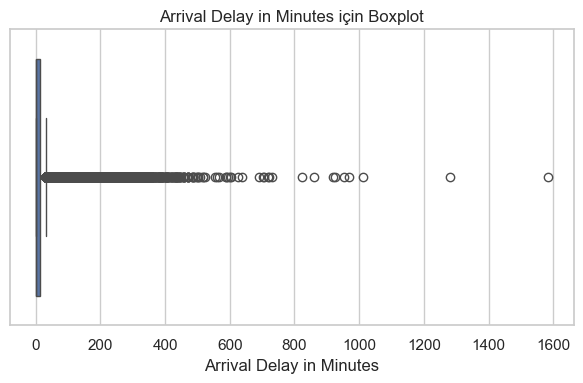
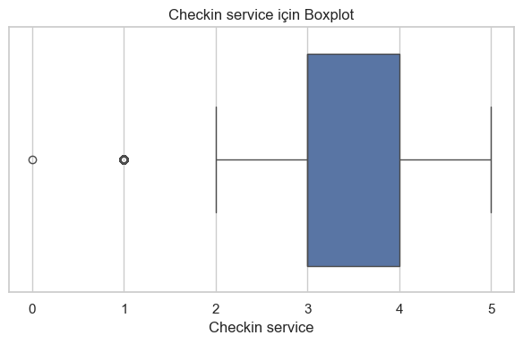

## 9. Sayısal Değişkenlerin Dağılımı (Histogramlar)

Her bir sayısal değişkenin dağılımını histogramlarla inceliyoruz. Bu grafikler değişkenlerin çarpıklığı ve dağılım özellikleri hakkında bilgi verir.

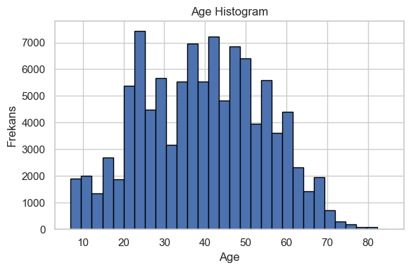
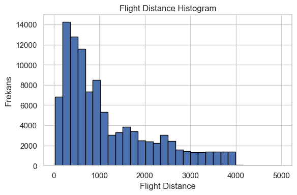

## 10. Kategorik Değişkenlerin Dağılımı

Bar grafikleri ile kategorik değişkenlerin sınıf dağılımlarını görselleştiriyoruz. Bu sayede örneğin "memnun" ve "memnun değil" yolcu sayılarının oranı gibi bilgiler elde edebiliriz.

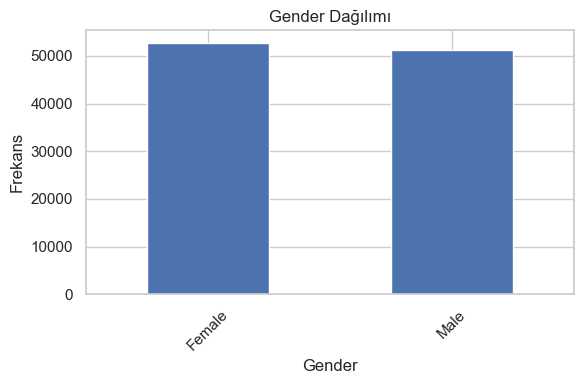
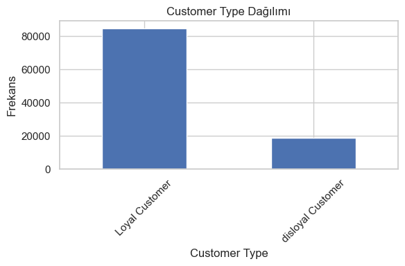
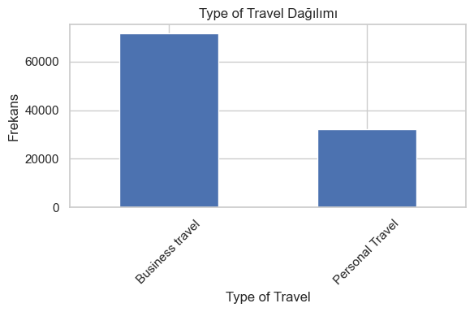
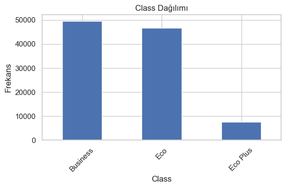
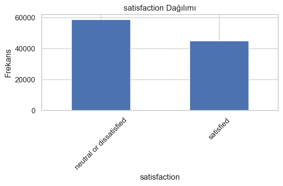

## 11. Sonuçlar

- Veri setinde sadece "Arrival Delay in Minutes" sütununda az sayıda eksik değer vardı.
- Hizmet kalitesine dair puanlar genel olarak ortalamanın üzerinde.
- Gecikme süresi gibi sütunlarda bazı uç değerler bulunmakta.
